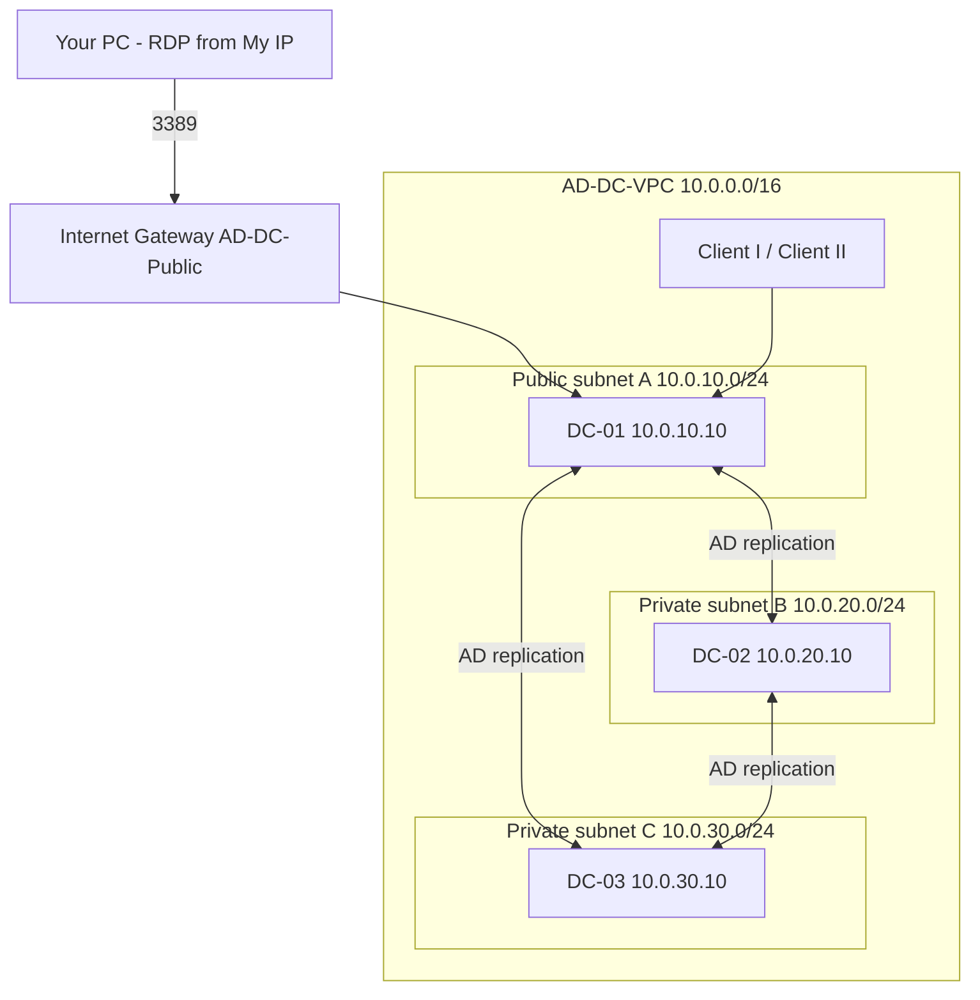
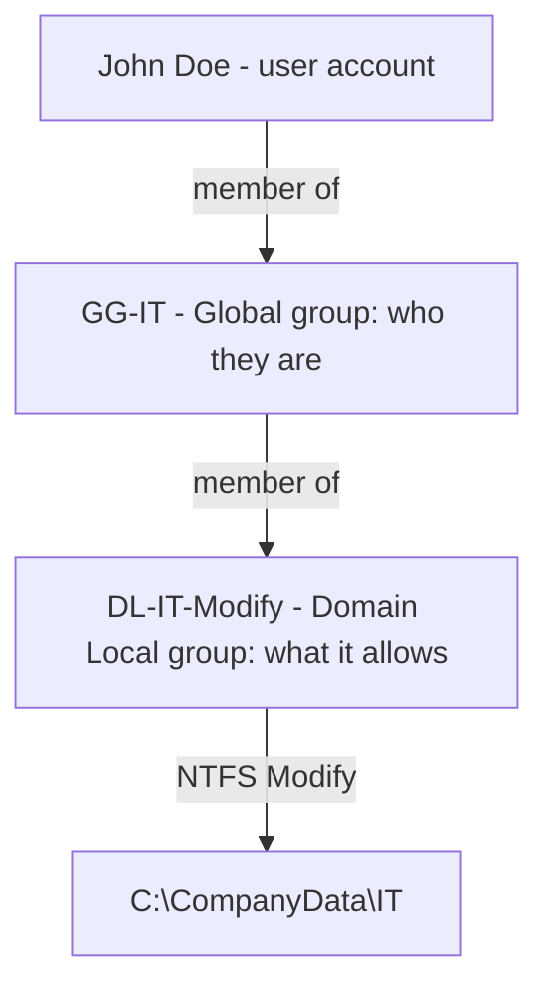
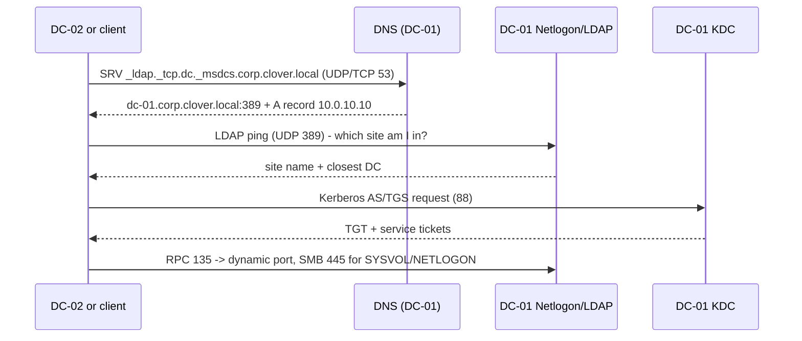

# Active Directory Lab on AWS — Complete Build & Troubleshooting Guide

Sep 25, 2026 · @sas

## Overview

This lab builds a three-Domain-Controller Active Directory forest, `corp.clover.local`, inside an AWS VPC in Europe (Stockholm, eu-north-1). DC-01 is reachable over RDP from the internet (for the lab only); DC-02 and DC-03 sit in private subnets and are managed through DC-01.

The goal was not only to revisit IAM theory but to build every layer by hand and see how the parts depend on each other: AWS networking carries the traffic, DNS lets machines find the domain, Kerberos and LDAP authenticate and query it, RPC and SMB replicate it, and groups plus NTFS permissions turn identity into access.

### What this lab covers

- AWS VPC, multi-subnet networking, Internet Gateway, route tables and DHCP option sets
- Windows Server on EC2 and Active Directory Domain Services (AD DS)
- Promoting the first Domain Controller (new forest) and adding replica DCs
- DNS and AD-integrated DNS zones, SRV records and DC discovery
- Organizational Units, users, Global Groups and Domain Local Groups
- AGDLP and group-based access control on NTFS folders and SMB shares
- Group Policy (GPO) fundamentals
- AD replication (repadmin, sites, KCC)
- Troubleshooting DNS, LDAP, Kerberos, RPC, SMB and Netlogon connectivity with PowerShell

### Security note before you publish anything

- The original notes contain the decrypted **Administrator password** for DC-01 in plain text. Change that password now (or terminate the instance) and remove it from any document, screenshot or post.
- Screenshots also show the AWS **account ID**, VPC, subnet and ENI IDs. They are not secrets on their own, but blur them before sharing publicly.
- Treat RDP-from-anywhere as temporary. This guide restricts it to your own IP.

## Architecture and IP plan

One VPC (`10.0.0.0/16`) holds three /24 subnets, one per Domain Controller, spread across three Availability Zones so a single AZ failure never takes down the domain. Each DC gets a fixed private IP ending in `.10`.

| Component | Name | CIDR / IP | AZ | Notes |
| --- | --- | --- | --- | --- |
| VPC | AD-DC-VPC | 10.0.0.0/16 | – | DNS resolution + DNS hostnames enabled |
| Internet Gateway | AD-DC-Public | – | – | Attached to AD-DC-VPC |
| Subnet A (public) | DC-01-Subnet | 10.0.10.0/24 | eu-north-1a | Route 0.0.0.0/0 → IGW |
| Subnet B (private) | DC-02-Subnet | 10.0.20.0/24 | eu-north-1b | Local routes only |
| Subnet C (private) | DC-03-Subnet | 10.0.30.0/24 | eu-north-1c | Local routes only |
| Domain Controller 1 | DC-01 | 10.0.10.10 | eu-north-1a | Forest root, all FSMO roles, GC, DNS, RDP jump host |
| Domain Controller 2 | DC-02 | 10.0.20.10 | eu-north-1b | Replica DC, GC, DNS |
| Domain Controller 3 | DC-03 | 10.0.30.10 | eu-north-1c | Replica DC, GC, DNS |
| Clients | CLIENT-01/02 | DHCP in any subnet | any | Domain-joined test machines |
| AD domain | corp.clover.local | – | – | NetBIOS name: CORP |



AWS reserves the first four addresses and the last address of every subnet (for example `10.0.10.0`–`10.0.10.3` and `10.0.10.255`), so `.10` is always safe for a DC. The diagram in the original notes labels the VPC `10.0.1.0/16`; the correct value is `10.0.0.0/16`.

## Phase 1 — AWS networking

Build the network first: VPC, Internet Gateway, three subnets, a public route table for DC-01 only, and a DHCP option set that points every machine at the Domain Controllers for DNS.

### 1.1 Create the VPC

1. VPC console → **Your VPCs** → **Create VPC** → **VPC only**.
2. Name tag: `AD-DC-VPC`.
3. IPv4 CIDR: `10.0.0.0/16`. No IPv6.
4. Create, then **Actions → Edit VPC settings** and enable **DNS resolution** and **DNS hostnames**.

Correction: one screenshot shows `10.0.0.0/24`. A /24 VPC cannot hold three /24 subnets such as `10.0.10.0/24`, so the VPC must be `/16`.

### 1.2 Create and attach the Internet Gateway

1. **Internet gateways → Create internet gateway**, name `AD-DC-Public`.
2. **Actions → Attach to VPC** → select `AD-DC-VPC`. State changes from Detached to Attached.

### 1.3 Create the three subnets

**Subnets → Create subnet**, choose `AD-DC-VPC`, then add one subnet per DC:

| Subnet name | AZ | IPv4 CIDR |
| --- | --- | --- |
| DC-01-Subnet | eu-north-1a | 10.0.10.0/24 |
| DC-02-Subnet | eu-north-1b | 10.0.20.0/24 |
| DC-03-Subnet | eu-north-1c | 10.0.30.0/24 |

Using three different AZs is the point of having three DCs; the original notes put everything in one AZ.

### 1.4 Public route table for DC-01

1. **Route tables → Create route table**, name `AD-DC01-PUBLIC`, VPC `AD-DC-VPC`.
2. **Actions → Edit routes → Add route**: Destination `0.0.0.0/0`, Target **Internet Gateway** `AD-DC-Public`. Save.
3. **Subnet associations → Edit subnet associations** → tick `DC-01-Subnet` only → Save.
4. Leave DC-02 and DC-03 on the VPC main route table (local `10.0.0.0/16` only), so they stay private.

Correction: the notes used destination `0.0.0.0/16`. That only covers `0.0.x.x` addresses, so RDP replies to your home IP would have no route back. The default route is `0.0.0.0/0`.

### 1.5 Enable public IP on the public subnet

**Subnets → DC-01-Subnet → Actions → Edit subnet settings** → tick **Enable auto-assign public IPv4 address**. For a stable address, allocate an **Elastic IP** and associate it with DC-01 after launch instead.

### 1.6 DHCP option set (DNS for the domain)

AD depends on DNS. Every domain member must use the DCs as DNS servers, not the AWS resolver at `10.0.0.2`. The cleanest AWS-native way is a DHCP option set. Create it now but associate it **after** DC-01 is promoted (Phase 5), otherwise instances lose DNS before any DC exists.

1. **DHCP option sets → Create**.
2. Domain name: `corp.clover.local`.
3. Domain name servers: `10.0.10.10, 10.0.20.10, 10.0.30.10`.
4. NTP servers: `169.254.169.123` (Amazon Time Sync).
5. Later: **Your VPCs → AD-DC-VPC → Actions → Edit VPC settings → DHCP option set** → select it, then run `ipconfig /renew` on each instance.

The DCs forward non-AD queries (internet names) to `10.0.0.2`, configured in Phase 5.

## Phase 2 — Security group DC-SG-CORP

The original six TCP rules are not enough for a second DC to join or replicate. AD also needs UDP for DNS, Kerberos and LDAP, the Global Catalog ports, Kerberos password change, time sync and the dynamic RPC range. Missing any of these is the most common reason a replica DC promotion fails.

Create: **EC2 → Security Groups → Create security group**, name `DC-SG-CORP`, description `AD-DC`, VPC `AD-DC-VPC`.

### Inbound rules

| Service | Protocol | Port(s) | Source | Why |
| --- | --- | --- | --- | --- |
| RDP | TCP | 3389 | **My IP** (x.x.x.x/32) | Admin access to DC-01 only |
| DNS | TCP + UDP | 53 | 10.0.0.0/16 | Name resolution, SRV lookups, zone transfer |
| Kerberos | TCP + UDP | 88 | 10.0.0.0/16 | Authentication tickets |
| RPC Endpoint Mapper | TCP | 135 | 10.0.0.0/16 | Finds the dynamic RPC port for a service |
| NetBIOS / Netlogon (legacy) | UDP 137–138, TCP 139 | 137–139 | 10.0.0.0/16 | Older clients, browser service |
| NTP (W32Time) | UDP | 123 | 10.0.0.0/16 | Kerberos needs clocks within 5 minutes |
| LDAP | TCP + UDP | 389 | 10.0.0.0/16 | Directory queries, DC locator ping (UDP) |
| SMB | TCP | 445 | 10.0.0.0/16 | SYSVOL/NETLOGON shares, GPO, DFSR |
| Kerberos password change | TCP + UDP | 464 | 10.0.0.0/16 | kpasswd |
| LDAPS | TCP | 636 | 10.0.0.0/16 | LDAP over TLS (once a cert exists) |
| Global Catalog | TCP | 3268–3269 | 10.0.0.0/16 | Forest-wide searches, logon UPN lookup |
| AD Web Services | TCP | 9389 | 10.0.0.0/16 | PowerShell AD module, ADAC |
| WinRM | TCP | 5985–5986 | 10.0.0.0/16 | Remote PowerShell from DC-01 |
| Dynamic RPC | TCP | 49152–65535 | 10.0.0.0/16 | Replication (DRSUAPI), Netlogon, DFSR, FRS |
| ICMP | ICMP | All | 10.0.0.0/16 | ping / Test-NetConnection diagnostics |

Simplest lab alternative: one rule **All traffic → Source = DC-SG-CORP (the group itself)** plus the RDP rule. Any instance in the group can then talk to any other on every port, while the internet only reaches 3389.

### Corrections to the original notes

- `0.0.0.0/32` matches no real address, so the RDP rule would block everything. The screenshot actually used `0.0.0.0/0` (the whole internet). Use **My IP** instead; public RDP is scanned and brute-forced within minutes.
- All rules in the screenshot are Custom **TCP**. DNS, Kerberos and LDAP ping also use **UDP**, so add UDP rules too.
- Outbound: keep the default **All traffic → 0.0.0.0/0**.

AWS security groups are only half of the firewall; Windows Defender Firewall on each DC is the other half. Promotion to DC automatically opens the AD ports in Windows, but check it when troubleshooting (Phase 10).

## Phase 3 — Network interfaces and EC2 launch

A Domain Controller must keep the same IP forever, because every client and DNS record points at it. In AWS you pin it by giving the instance a fixed primary private IP (via a pre-created ENI or the launch wizard), then leave Windows on DHCP so it always receives that same address.

### 3.1 Create one ENI per DC (optional but clean)

**EC2 → Network interfaces → Create network interface**:

| ENI description | Subnet | Private IPv4 (Custom) | Security group |
| --- | --- | --- | --- |
| DC-01-ENI | DC-01-Subnet | 10.0.10.10 | DC-SG-CORP |
| DC-02-ENI | DC-02-Subnet | 10.0.20.10 | DC-SG-CORP |
| DC-03-ENI | DC-03-Subnet | 10.0.30.10 | DC-SG-CORP |

Interface type: ENA. Choose **Custom** under Private IPv4 address and type the IP. Tick only `DC-SG-CORP`, not the default group.

Alternative without ENIs: in the launch wizard, open **Network settings → Advanced network configuration** and type the IP in **Primary IP**. Do one or the other, not both.

### 3.2 Create a key pair

**EC2 → Key pairs → Create key pair**, name `DC-PairKeys`, type RSA, format `.pem`. Store it safely; it is the only way to decrypt the initial Administrator password.

### 3.3 Launch the three instances

Repeat for DC-01, DC-02 and DC-03:

1. **Launch instance**, Name: `DC-01` (then `DC-02`, `DC-03`).
2. AMI: **Microsoft Windows Server 2022 Base** (or 2025). The screenshots show an Amazon Linux AMI — that must be a Windows Server AMI.
3. Instance type: **t3.medium** (2 vCPU, 4 GiB) minimum. `t3.micro` (1 GiB RAM) runs Windows Server very poorly and often breaks DC promotion.
4. Key pair: `DC-PairKeys`.
5. Network settings → Edit: VPC `AD-DC-VPC`, the matching subnet, security group `DC-SG-CORP`.
6. Auto-assign public IP: **Enable** for DC-01 only; **Disable** for DC-02 and DC-03.
7. Advanced network configuration: attach the pre-created ENI as device index 0, or set Primary IP to the DC's address.
8. Storage: 50 GiB gp3 is plenty.
9. Launch.

Optional hardening: on each DC instance, **Actions → Instance settings → Change termination protection** → enable, so a lab DC is not deleted by accident.

### 3.4 Get the Administrator password and connect

1. Wait about 4 minutes after launch, then **Instance → Connect → RDP client → Get password**.
2. Upload `DC-PairKeys.pem` → **Decrypt password**. Username is `Administrator`.
3. RDP to the public IP (or Elastic IP) of DC-01 with that password.
4. Change the password immediately. Never paste the decrypted password into notes or posts.
5. DC-02 and DC-03 have no public IP: from inside DC-01, open `mstsc` and connect to `10.0.20.10` and `10.0.30.10`. DC-01 acts as your jump host.

The private DCs have no internet route. That is fine for AD. For Windows Update, add a NAT Gateway to the private subnets or use Systems Manager Session Manager with VPC endpoints.

## Phase 4 — Prepare Windows on every DC

Do these steps on each server before promotion: rename it, confirm the IP, point DNS correctly, and sync time. Run PowerShell **as Administrator**.

### 4.1 Rename the computer

```powershell
# DC-01 (use DC-02 / DC-03 on the other servers)
Rename-Computer -NewName "DC-01" -Restart
```

Rename before promotion. Renaming a DC afterwards is possible (`netdom computername`) but messy.

### 4.2 Confirm the network configuration

```powershell
Get-NetIPConfiguration
Get-NetAdapter | Select-Object Name, Status, MacAddress
# Expected on DC-01: IPv4Address 10.0.10.10, gateway 10.0.10.1
```

Keep the adapter on DHCP. AWS always hands the instance the same primary private IP, and a hard-coded static IP in Windows can break the instance if you ever change the ENI. If you prefer static anyway, it must match the ENI exactly:

```powershell
$if = (Get-NetAdapter | Where-Object Status -eq 'Up').ifIndex
New-NetIPAddress -InterfaceIndex $if -IPAddress 10.0.10.10 -PrefixLength 24 -DefaultGateway 10.0.10.1
```

### 4.3 Set DNS servers correctly

The rule: a DC uses **another DC first and itself second** (`127.0.0.1` last). A new domain member must point at an existing DC, never at the AWS resolver, or it cannot find the domain.

```powershell
$if = (Get-NetAdapter | Where-Object Status -eq 'Up').ifIndex

# DC-01 before promotion (no DC exists yet): leave AWS DNS so it can reach the internet
# DC-01 after promotion:
Set-DnsClientServerAddress -InterfaceIndex $if -ServerAddresses 10.0.20.10,127.0.0.1

# DC-02 BEFORE promotion (must find corp.clover.local):
Set-DnsClientServerAddress -InterfaceIndex $if -ServerAddresses 10.0.10.10
# DC-02 after promotion:
Set-DnsClientServerAddress -InterfaceIndex $if -ServerAddresses 10.0.10.10,127.0.0.1

# DC-03 before promotion:
Set-DnsClientServerAddress -InterfaceIndex $if -ServerAddresses 10.0.10.10,10.0.20.10

Get-DnsClientServerAddress -AddressFamily IPv4
Clear-DnsClientCache
```

Once the DHCP option set from 1.6 is attached to the VPC, you can drop the manual DNS settings on clients; keep explicit settings on the DCs.

### 4.4 Time sync

Kerberos rejects tickets if clocks differ by more than 5 minutes. On EC2, Windows syncs from Amazon Time Sync (`169.254.169.123`). After promotion only the PDC Emulator (DC-01) should use it; the others follow the domain hierarchy.

```powershell
w32tm /query /status
w32tm /query /source
```

### 4.5 Install the AD DS role (all three DCs)

```powershell
Install-WindowsFeature AD-Domain-Services, DNS -IncludeManagementTools
Get-WindowsFeature AD-Domain-Services, DNS, RSAT-AD-Tools
```

## Phase 5 — Promote DC-01 (new forest corp.clover.local)

DC-01 creates the forest, the domain, the AD-integrated DNS zone and holds all five FSMO roles.

### 5.1 Create the forest

```powershell
Import-Module ADDSDeployment

Install-ADDSForest `
  -DomainName "corp.clover.local" `
  -DomainNetbiosName "CORP" `
  -ForestMode "WinThreshold" `
  -DomainMode "WinThreshold" `
  -InstallDns:$true `
  -DatabasePath "C:\Windows\NTDS" `
  -LogPath "C:\Windows\NTDS" `
  -SysvolPath "C:\Windows\SYSVOL" `
  -SafeModeAdministratorPassword (Read-Host -AsSecureString "DSRM password") `
  -NoRebootOnCompletion:$false `
  -Force
```

The server reboots. Log in as `CORP\Administrator`. The DSRM password is the recovery password for Directory Services Restore Mode — store it in a password manager.

GUI equivalent: Server Manager → notification flag → **Promote this server to a domain controller** → **Add a new forest** → `corp.clover.local`.

### 5.2 Configure DNS on DC-01

```powershell
# Forward internet names to the AWS VPC resolver
Add-DnsServerForwarder -IPAddress 10.0.0.2 -PassThru
Get-DnsServerForwarder

# Reverse lookup zones for the three subnets (AD-integrated, replicated forest-wide)
"10.0.10.0/24","10.0.20.0/24","10.0.30.0/24" | ForEach-Object {
  Add-DnsServerPrimaryZone -NetworkId $_ -ReplicationScope Forest
}

# Allow only secure dynamic updates
Set-DnsServerPrimaryZone -Name "corp.clover.local" -DynamicUpdate Secure

# Scavenging of stale records (lab values)
Set-DnsServerScavenging -ScavengingState $true -ScavengingInterval 7.00:00:00 -ApplyOnAllZones
```

### 5.3 Create AD sites and subnets

Sites tell clients which DC is closest and tell the KCC how to build replication. One site per AZ mirrors the AWS layout.

```powershell
New-ADReplicationSite -Name "AWS-eu-north-1a"
New-ADReplicationSite -Name "AWS-eu-north-1b"
New-ADReplicationSite -Name "AWS-eu-north-1c"

New-ADReplicationSubnet -Name "10.0.10.0/24" -Site "AWS-eu-north-1a"
New-ADReplicationSubnet -Name "10.0.20.0/24" -Site "AWS-eu-north-1b"
New-ADReplicationSubnet -Name "10.0.30.0/24" -Site "AWS-eu-north-1c"

# Move DC-01 out of Default-First-Site-Name
Move-ADDirectoryServer -Identity "DC-01" -Site "AWS-eu-north-1a"

# One site link, replicate every 15 minutes
New-ADReplicationSiteLink -Name "AWS-AZ-Link" `
  -SitesIncluded "AWS-eu-north-1a","AWS-eu-north-1b","AWS-eu-north-1c" `
  -Cost 100 -ReplicationFrequencyInMinutes 15
```

Simpler option for a lab: keep everything in `Default-First-Site-Name`. Replication then happens within seconds (intra-site change notification).

### 5.4 Make DC-01 the authoritative time source

```powershell
w32tm /config /manualpeerlist:"169.254.169.123" /syncfromflags:manual /reliable:yes /update
Restart-Service w32time
w32tm /resync
```

### 5.5 Attach the DHCP option set

Now that a DC answers DNS, associate the option set from 1.6 with `AD-DC-VPC`, then `ipconfig /renew`. Set DC-01's own DNS as in 4.3.

### 5.6 Verify DC-01

```powershell
Get-ADDomain | Select-Object DNSRoot, NetBIOSName, PDCEmulator, RIDMaster, InfrastructureMaster
Get-ADForest | Select-Object Name, SchemaMaster, DomainNamingMaster, ForestMode
netdom query fsmo
Get-SmbShare | Where-Object Name -in 'SYSVOL','NETLOGON'
Resolve-DnsName -Type SRV _ldap._tcp.dc._msdcs.corp.clover.local
dcdiag /q
```

You want: SYSVOL and NETLOGON shares present, the SRV record returning `dc-01.corp.clover.local`, and `dcdiag /q` printing nothing (no errors).

## Phase 6 — OUs, users, groups and AGDLP

Access is never granted to a user directly. Users go into Global groups by role, Global groups go into Domain Local groups by permission, and only Domain Local groups appear on folder ACLs. That is **AGDLP**: Accounts → Global → Domain Local → Permissions.



| Group scope | Can contain | Used for | Prefix in this lab |
| --- | --- | --- | --- |
| Global | Users/groups from the same domain | Role or department (who) | `GG-` |
| Domain Local | Users, Global and Universal groups from any trusted domain | Resource permission (what) | `DL-` |
| Universal | Any domain in the forest | Cross-domain roles in multi-domain forests | `UG-` |

### 6.1 OU structure

This mirrors the ADUC screenshot: `DTAG` with `IT` (sub-OUs `IAM`, `CC\ICT`), `HR`, `Finance`, plus `DTNA`. Add `Groups` and `Servers` OUs so objects are not left in the default containers.

```powershell
$base = "DC=corp,DC=clover,DC=local"

New-ADOrganizationalUnit -Name "DTAG" -Path $base
New-ADOrganizationalUnit -Name "DTNA" -Path $base
"IT","HR","Finance","Groups","Servers" | ForEach-Object {
  New-ADOrganizationalUnit -Name $_ -Path "OU=DTAG,$base"
}
"IAM","CC-ICT" | ForEach-Object {
  New-ADOrganizationalUnit -Name $_ -Path "OU=IT,OU=DTAG,$base"
}

Get-ADOrganizationalUnit -Filter * | Select-Object Name, DistinguishedName
```

`New-ADOrganizationalUnit` sets **Protect from accidental deletion** by default. Avoid `\` in OU names (`CC\ICT`); it must be escaped in every DN.

### 6.2 Users

```powershell
$pw = Read-Host -AsSecureString "Initial password"

New-ADUser -Name "John Doe" -GivenName John -Surname Doe `
  -SamAccountName jdoe -UserPrincipalName jdoe@corp.clover.local `
  -Path "OU=IAM,OU=IT,OU=DTAG,DC=corp,DC=clover,DC=local" `
  -AccountPassword $pw -Enabled $true -ChangePasswordAtLogon $true

# Bulk from CSV: Name,Sam,OU
Import-Csv .\users.csv | ForEach-Object {
  New-ADUser -Name $_.Name -SamAccountName $_.Sam `
    -UserPrincipalName "$($_.Sam)@corp.clover.local" -Path $_.OU `
    -AccountPassword $pw -Enabled $true -ChangePasswordAtLogon $true
}
```

### 6.3 Groups and nesting (AGDLP)

```powershell
$grp = "OU=Groups,OU=DTAG,DC=corp,DC=clover,DC=local"

New-ADGroup -Name "GG-IT"        -GroupScope Global      -GroupCategory Security -Path $grp
New-ADGroup -Name "GG-IAM-DTAG"  -GroupScope Global      -GroupCategory Security -Path $grp
New-ADGroup -Name "DL-IT-Modify" -GroupScope DomainLocal -GroupCategory Security -Path $grp
New-ADGroup -Name "DL-IT-Read"   -GroupScope DomainLocal -GroupCategory Security -Path $grp

# A: account into G
Add-ADGroupMember -Identity "GG-IT" -Members jdoe
# G into DL
Add-ADGroupMember -Identity "DL-IT-Modify" -Members "GG-IT"

# Verify the full chain
Get-ADGroupMember "DL-IT-Modify" -Recursive | Select-Object Name, SamAccountName
Get-ADPrincipalGroupMembership jdoe | Select-Object Name, GroupScope
```

### 6.4 NTFS permissions (P)

```powershell
New-Item -Path "C:\CompanyData\IT" -ItemType Directory -Force

# Stop inheriting broad rights, keep Administrators/SYSTEM, remove Users
icacls "C:\CompanyData\IT" /inheritance:d
icacls "C:\CompanyData\IT" /remove:g "BUILTIN\Users"

# (OI)(CI) = apply to subfolders and files; M = Modify, RX = Read & Execute
icacls "C:\CompanyData\IT" /grant "CORP\DL-IT-Modify:(OI)(CI)M"
icacls "C:\CompanyData\IT" /grant "CORP\DL-IT-Read:(OI)(CI)RX"

icacls "C:\CompanyData\IT"
```

### 6.5 SMB share

The effective right is the **most restrictive** of share and NTFS permissions. Standard practice: share = Authenticated Users Full/Change, NTFS does the real control.

```powershell
New-SmbShare -Name "IT$" -Path "C:\CompanyData\IT" `
  -ChangeAccess "CORP\Domain Users" -FullAccess "CORP\Domain Admins" `
  -FolderEnumerationMode AccessBased
Get-SmbShareAccess -Name "IT$"
```

### 6.6 Test the access

```powershell
# From a client logged on as CORP\jdoe
whoami /groups | findstr /i "GG-IT DL-IT"
New-Item "\\DC-01\IT$\test.txt" -ItemType File   # should succeed
```

Group membership lives in the Kerberos ticket, so after adding a user to a group they must **log off and on** (or run `klist purge`) before the new access works. File servers in production should be member servers, not DCs; using DC-01 here is a lab shortcut.

## Phase 7 — Group Policy fundamentals

A GPO is a set of settings stored in two places: the Group Policy Container in AD (replicated by AD) and the Group Policy Template in `\\corp.clover.local\SYSVOL` (replicated by DFSR). It only applies where it is **linked** — a site, the domain, or an OU.

Processing order is **LSDOU**: Local → Site → Domain → OU (parent then child). Later wins, unless a higher link is **Enforced** or a lower OU **Blocks inheritance**. Security filtering and WMI filters narrow who receives it.

### 7.1 Domain password and lockout policy

Password policy for domain accounts only works in a GPO linked at the domain (normally the Default Domain Policy) or via Fine-Grained Password Policies.

```powershell
Set-ADDefaultDomainPasswordPolicy -Identity corp.clover.local `
  -MinPasswordLength 12 -ComplexityEnabled $true `
  -LockoutThreshold 5 -LockoutDuration 00:15:00 -LockoutObservationWindow 00:15:00
Get-ADDefaultDomainPasswordPolicy

# Stricter policy only for admins (Fine-Grained Password Policy)
New-ADFineGrainedPasswordPolicy -Name "FGPP-Admins" -Precedence 10 `
  -MinPasswordLength 16 -ComplexityEnabled $true -LockoutThreshold 3
Add-ADFineGrainedPasswordPolicySubject "FGPP-Admins" -Subjects "Domain Admins"
```

### 7.2 Create, configure and link a GPO

```powershell
Import-Module GroupPolicy

# Create a GPO and link it to the IT OU
New-GPO -Name "GPO-IT-Baseline" -Comment "IT OU baseline"
New-GPLink -Name "GPO-IT-Baseline" -Target "OU=IT,OU=DTAG,DC=corp,DC=clover,DC=local"

# Example registry-based setting: hide the last signed-in user name
Set-GPRegistryValue -Name "GPO-IT-Baseline" `
  -Key "HKLM\Software\Microsoft\Windows\CurrentVersion\Policies\System" `
  -ValueName "DontDisplayLastUserName" -Type DWord -Value 1

# Security filtering: apply only to GG-IT
Set-GPPermission -Name "GPO-IT-Baseline" -TargetName "GG-IT" -TargetType Group -PermissionLevel GpoApply
```

Drive maps, desktop wallpaper and similar items are easier in the GUI: `gpmc.msc` → right-click the GPO → **Edit** → User Configuration → Preferences → Windows Settings → **Drive Maps** → `\\DC-01\IT$`, item-level targeting on `GG-IT`.

### 7.3 Apply and verify

```powershell
gpupdate /force
gpresult /r                           # summary: which GPOs applied / filtered out
gpresult /h C:\Temp\gp.html           # full HTML report
Get-GPInheritance -Target "OU=IT,OU=DTAG,DC=corp,DC=clover,DC=local"
Get-GPOReport -Name "GPO-IT-Baseline" -ReportType Html -Path C:\Temp\gpo.html

# Force a refresh on remote machines
Invoke-GPUpdate -Computer CLIENT-01 -Force -RandomDelayInMinutes 0
```

### 7.4 Common GPO pitfalls

- GPO linked to an OU that holds only users, but the setting is under Computer Configuration (or the reverse). Objects must be in the OU the GPO targets.
- Objects left in the default `Users`/`Computers` containers — GPOs cannot be linked to containers, only to OUs.
- SYSVOL not replicated to the DC the client talks to → `gpresult` shows the GPO but settings are missing. Check DFSR (Phase 9).
- Removing `Authenticated Users` from security filtering also removes their Read right; since 2016 the computer needs Read, so add `Domain Computers` with Read.

## Phase 8 — Add DC-02 and DC-03 as replica DCs

A replica DC joins the existing domain and copies the whole directory from DC-01. Before promoting, prove that DC-02 can find and reach DC-01 — almost every failed promotion is a DNS or port problem, not an AD problem.

### 8.1 Pre-flight checks on DC-02 (run before promotion)

```powershell
# DNS must point at DC-01 (see 4.3)
Get-DnsClientServerAddress -AddressFamily IPv4

# Can DC-02 resolve the domain and find a DC through SRV records?
Resolve-DnsName corp.clover.local
Resolve-DnsName -Type SRV _ldap._tcp.dc._msdcs.corp.clover.local
nltest /dsgetdc:corp.clover.local

# Are the key ports open to DC-01?
53,88,135,389,445,464,3268,9389 | ForEach-Object {
  $r = Test-NetConnection 10.0.10.10 -Port $_ -WarningAction SilentlyContinue
  "{0,-5} {1}" -f $_, $r.TcpTestSucceeded
}

# Clock difference to DC-01 (must be < 5 min)
w32tm /stripchart /computer:10.0.10.10 /samples:3 /dataonly
```

All ports must return `True`. If `nltest /dsgetdc` fails, stop and fix DNS first (Phase 10).

### 8.2 Join the domain (optional step) and promote

You can promote directly from a workgroup server; the wizard joins it. Joining first makes problems easier to isolate:

```powershell
Add-Computer -DomainName corp.clover.local -Credential CORP\Administrator -Restart
```

Then promote DC-02:

```powershell
Install-WindowsFeature AD-Domain-Services, DNS -IncludeManagementTools   # if not done in 4.5

Install-ADDSDomainController `
  -DomainName "corp.clover.local" `
  -Credential (Get-Credential CORP\Administrator) `
  -SiteName "AWS-eu-north-1b" `
  -InstallDns:$true `
  -NoGlobalCatalog:$false `
  -ReplicationSourceDC "DC-01.corp.clover.local" `
  -DatabasePath "C:\Windows\NTDS" -LogPath "C:\Windows\NTDS" -SysvolPath "C:\Windows\SYSVOL" `
  -SafeModeAdministratorPassword (Read-Host -AsSecureString "DSRM password") `
  -Force
```

Run `Test-ADDSDomainControllerInstallation` with the same parameters first to get a dry-run report of any blockers.

### 8.3 Repeat for DC-03

Same commands on DC-03 with `-SiteName "AWS-eu-north-1c"` and DNS pointing at `10.0.10.10, 10.0.20.10` before promotion.

### 8.4 Post-promotion DNS on the replica DCs

```powershell
$if = (Get-NetAdapter | Where-Object Status -eq 'Up').ifIndex
# DC-02
Set-DnsClientServerAddress -InterfaceIndex $if -ServerAddresses 10.0.10.10,127.0.0.1
# DC-03
Set-DnsClientServerAddress -InterfaceIndex $if -ServerAddresses 10.0.10.10,127.0.0.1
# Forwarder on every DC
Add-DnsServerForwarder -IPAddress 10.0.0.2
# Register the DC's SRV and A records now instead of waiting
ipconfig /registerdns
nltest /dsregdns
Restart-Service netlogon
```

### 8.5 Point DC-01 at a partner

Now that DC-02 exists, give DC-01 a partner DNS first (`10.0.20.10,127.0.0.1`) as in 4.3. This avoids the "island" problem where a DC only resolves against itself and stops registering correctly after a restart.

### 8.6 Distributing FSMO roles (optional)

In a small forest keeping all five roles on DC-01 is fine. To practise moving them:

```powershell
Move-ADDirectoryServerOperationMasterRole -Identity "DC-02" -OperationMasterRole RIDMaster, InfrastructureMaster
netdom query fsmo
```

If you move the PDC Emulator, move the external time configuration (5.4) with it.

## Phase 9 — Replication and health verification

AD uses **multi-master** replication: every DC accepts changes and passes them on. The **KCC** (Knowledge Consistency Checker) builds the connection objects automatically; within a site changes arrive in about 15 seconds, between sites on the site-link schedule (15 minutes here). The directory replicates over RPC (DRSUAPI); SYSVOL replicates separately over **DFSR**.

Each change carries a USN (Update Sequence Number) and a version; the up-to-dateness vector stops a DC from receiving the same change twice.

### 9.1 Quick health check

```powershell
repadmin /replsummary                    # failures and largest delta per DC
repadmin /showrepl * /csv | ConvertFrom-Csv | Format-Table "Source DSA","Destination DSA","Number of Failures","Last Success Time"
repadmin /queue                          # pending inbound replication
Get-ADReplicationFailure -Scope Domain -Target corp.clover.local
Get-ADReplicationPartnerMetadata -Target * -Scope Domain | Select-Object Server, Partner, LastReplicationSuccess, LastReplicationResult
```

`LastReplicationResult` must be `0` and failures must be 0 for every partner.

### 9.2 Prove replication end to end

```powershell
# On DC-01: create a test object
New-ADUser -Name "Repl Test" -SamAccountName repltest -Path "OU=IT,OU=DTAG,DC=corp,DC=clover,DC=local"

# Push the change everywhere now
repadmin /syncall DC-01 /AdeP

# On DC-02 and DC-03: it should exist
Get-ADUser repltest -Server DC-02
Get-ADUser repltest -Server DC-03

# Where did the attribute last change, and at which USN?
repadmin /showobjmeta DC-02 "CN=Repl Test,OU=IT,OU=DTAG,DC=corp,DC=clover,DC=local"
```

`/AdeP` = All partitions, across sites (e), Push, by DN (d). Delete the test user afterwards.

### 9.3 SYSVOL (DFSR) replication

```powershell
# Migration state must be 'Eliminated' (DFSR in use, not FRS)
dfsrmig /getglobalstate

# Shares must exist on every DC
Get-SmbShare -CimSession DC-01,DC-02,DC-03 | Where-Object Name -in 'SYSVOL','NETLOGON'

# DFSR state and backlog DC-01 -> DC-02
Get-DfsrState -ComputerName DC-02
dfsrdiag backlog /rgname:"Domain System Volume" /rfname:"SYSVOL Share" /smem:DC-01 /rmem:DC-02

# Check the event log for DFSR errors (4012 = stale, 2213 = dirty shutdown)
Get-WinEvent -LogName "DFS Replication" -MaxEvents 20 | Where-Object LevelDisplayName -ne 'Information'
```

Error 2213 after an unclean shutdown (common when EC2 instances are stopped abruptly) is fixed by the command in the event text: `wmic /namespace:\\root\microsoftdfs path dfsrVolumeConfig where volumeGuid="<GUID>" call ResumeReplication`.

### 9.4 Full DC diagnostics

```powershell
dcdiag /e /v /c /f:C:\Temp\dcdiag.txt     # every DC, every test, to a file
dcdiag /test:dns /e /v                     # DNS registration and delegation
dcdiag /test:replications /e
dcdiag /test:advertising                   # is the DC advertising as DC/GC/KDC/time server?
dcdiag /test:netlogons /test:sysvolcheck
```

### 9.5 Replication health — what good looks like

| Check | Command | Healthy result |
| --- | --- | --- |
| Replication summary | `repadmin /replsummary` | 0 fails, largest delta < 60 min |
| Partners | `repadmin /showrepl` | "was successful" for every partition |
| Queue | `repadmin /queue` | 0 items |
| SYSVOL shares | `Get-SmbShare` | SYSVOL + NETLOGON on all 3 DCs |
| DFSR | `dfsrmig /getglobalstate` | Eliminated |
| DC advertising | `dcdiag /test:advertising` | passed |
| FSMO | `netdom query fsmo` | all roles answer |

## Phase 10 — Troubleshooting playbook

Work **bottom-up**: AWS network → Windows firewall → DNS → time → LDAP → Kerberos → RPC → SMB/SYSVOL → Netlogon → replication. A failure low in the stack shows up as a confusing error higher up (for example "access denied" that is really a clock skew).

### 10.1 How a machine finds a DC (the DC locator)



If step 1 fails, everything after it fails — which is why most AD problems are DNS problems.

### 10.2 Layer 1 — AWS and network reachability

```powershell
Test-NetConnection 10.0.10.10                    # ICMP
Test-NetConnection 10.0.10.10 -Port 389 -InformationLevel Detailed
# Sweep the AD ports
$ports = 53,88,135,139,389,445,464,636,3268,3269,5985,9389
foreach ($p in $ports) { "{0,-6}{1}" -f $p,(Test-NetConnection 10.0.10.10 -Port $p -WarningAction SilentlyContinue).TcpTestSucceeded }

# UDP cannot be tested with Test-NetConnection; use PortQry (Microsoft download)
portqry -n 10.0.10.10 -p udp -e 389
portqry -n 10.0.10.10 -p udp -e 53
```

All `False` from one subnet → check the security group rules, the subnet NACL and the route table. Only high ports failing → the dynamic RPC range 49152–65535 is missing from `DC-SG-CORP`. Also check **VPC Flow Logs** for REJECT records.

### 10.3 Layer 2 — Windows Firewall

```powershell
Get-NetFirewallProfile | Select-Object Name, Enabled
Get-NetFirewallRule -DisplayGroup "Active Directory Domain Services" | Select-Object DisplayName, Enabled, Direction
Get-NetFirewallRule -DisplayGroup "DNS Service" | Select-Object DisplayName, Enabled
# Network category should be DomainAuthenticated on a DC
Get-NetConnectionProfile
```

If the category shows **Public** after reboot, the NLA service could not reach a DC during boot (usually DNS). Fix DNS, then `Restart-Service NlaSvc -Force`.

### 10.4 Layer 3 — DNS and SRV records

```powershell
Get-DnsClientServerAddress -AddressFamily IPv4          # pointing at a DC?
Resolve-DnsName corp.clover.local
Resolve-DnsName dc-01.corp.clover.local
Resolve-DnsName -Type SRV _ldap._tcp.dc._msdcs.corp.clover.local
Resolve-DnsName -Type SRV _kerberos._tcp.corp.clover.local
Resolve-DnsName -Type SRV _gc._tcp.corp.clover.local
Resolve-DnsName -Type SRV _ldap._tcp.AWS-eu-north-1b._sites.corp.clover.local

# Each DC's GUID-based CNAME used by replication
(Get-ADDomainController -Filter *) | ForEach-Object { "$($_.Name): $((Get-ADObject $_.NTDSSettingsObjectDN -Properties objectGUID).objectGUID)._msdcs.corp.clover.local" }

nslookup
> server 10.0.10.10
> set type=SRV
> _ldap._tcp.dc._msdcs.corp.clover.local

# Fix missing registrations
ipconfig /flushdns
ipconfig /registerdns
nltest /dsregdns
Restart-Service netlogon
dcdiag /test:dns /v /e

# On the DNS server
Get-DnsServerZone
Get-DnsServerResourceRecord -ZoneName "_msdcs.corp.clover.local" -RRType Srv
```

The SRV records come from `C:\Windows\System32\config\netlogon.dns`; Netlogon registers them at start and every 24 hours.

### 10.5 Layer 4 — Time

```powershell
w32tm /query /status
w32tm /query /source                   # DCs: another DC or the PDC; DC-01: 169.254.169.123
w32tm /monitor /domain:corp.clover.local
w32tm /resync /rediscover
```

Skew > 5 minutes produces `KRB_AP_ERR_SKEW` and generic "access denied" or "target principal name is incorrect" errors.

### 10.6 Layer 5 — LDAP

```powershell
# RootDSE answers without credentials if LDAP is up
[ADSI]"LDAP://10.0.10.10/RootDSE" | Select-Object dnsHostName, defaultNamingContext, isSynchronized, isGlobalCatalogReady

Get-ADDomainController -Discover -DomainName corp.clover.local
Get-ADDomainController -Filter * | Select-Object Name, IPv4Address, Site, IsGlobalCatalog, OperationMasterRoles

# Query a specific DC
Get-ADUser jdoe -Server DC-02

# GUI: ldp.exe → Connect 10.0.10.10:389 → Bind as CORP\Administrator
```

`isSynchronized: FALSE` on a new DC means initial replication is not complete — it will not advertise as a DC until it is.

### 10.7 Layer 6 — Kerberos

```powershell
klist                                   # tickets in the current session
klist tgt
klist purge                             # drop tickets after group change / fix
klist get krbtgt/CORP.CLOVER.LOCAL

# SPNs of a DC (duplicates break Kerberos)
setspn -L DC-01
setspn -X -F                            # search forest for duplicate SPNs

# Kerberos errors in the log
Get-WinEvent -LogName System -MaxEvents 50 | Where-Object ProviderName -match 'Kerberos|KDC'
```

Common causes: clock skew, duplicate SPN, connecting by IP instead of name (IP forces NTLM fallback), or a broken computer secure channel.

### 10.8 Layer 7 — RPC

```powershell
Test-NetConnection 10.0.10.10 -Port 135
# List RPC endpoints registered on DC-01 (PortQry)
portqry -n 10.0.10.10 -e 135

# The fixed port the NTDS replication service is using, if pinned
Get-ItemProperty "HKLM:\SYSTEM\CurrentControlSet\Services\NTDS\Parameters" -Name "TCP/IP Port" -ErrorAction SilentlyContinue

repadmin /bind DC-01                    # DRSUAPI bind over RPC
```

Error 1722 "The RPC server is unavailable" = port 135 or the dynamic range is blocked, or DNS resolves the name to a wrong IP. Error 1753 "There are no more endpoints available" = 135 open but the dynamic range blocked.

### 10.9 Layer 8 — SMB, SYSVOL and NETLOGON

```powershell
Test-Path \\corp.clover.local\SYSVOL
Test-Path \\DC-02\NETLOGON
Get-SmbShare -CimSession DC-02
net view \\DC-02
# SysvolReady must be 1
Get-ItemProperty "HKLM:\SYSTEM\CurrentControlSet\Services\Netlogon\Parameters" -Name SysvolReady
```

If SYSVOL/NETLOGON are missing on a new DC, the first DFSR sync has not finished — look for DFSR event 4602 ("initialized SYSVOL") vs 4614 ("waiting").

### 10.10 Layer 9 — Netlogon and the secure channel

```powershell
nltest /dsgetdc:corp.clover.local /force
nltest /sc_query:corp.clover.local       # secure channel status
nltest /sc_verify:corp.clover.local
Test-ComputerSecureChannel -Verbose
Test-ComputerSecureChannel -Repair -Credential CORP\Administrator
nltest /dclist:corp.clover.local
Get-Service Netlogon, NTDS, DNS, KDC, W32Time, DFSR | Select-Object Name, Status

# Verbose Netlogon logging (C:\Windows\debug\netlogon.log); turn off afterwards
nltest /dbflag:0x2080ffff
nltest /dbflag:0x0
```

### 10.11 Common errors and fixes

| Error / symptom | Usual cause | Fix |
| --- | --- | --- |
| "An Active Directory Domain Controller for the domain could not be contacted" | New server's DNS points at AWS resolver, or SRV records missing | Set DNS to 10.0.10.10; `nltest /dsregdns` on DC-01 |
| 1722 RPC server is unavailable | SG/firewall blocks 135 or 49152–65535; wrong A record | Open ports; `Resolve-DnsName` the DC; `repadmin /bind` |
| 1753 No more endpoints | Dynamic RPC range blocked | Add TCP 49152–65535 to `DC-SG-CORP` |
| 8524 DSA operation unable to proceed because of a DNS lookup failure | Partner's GUID CNAME missing in `_msdcs` | `ipconfig /registerdns`, restart Netlogon on the partner |
| 1256 / 1908 could not find the domain controller | DNS or Kerberos unreachable | Check 53 and 88 TCP+UDP |
| KRB\_AP\_ERR\_SKEW / 1398 | Clock skew > 5 min | Fix W32Time; `w32tm /resync` |
| -2146893022 target principal name is incorrect | Stale computer password or duplicate SPN / wrong IP in DNS | `Test-ComputerSecureChannel -Repair`; `setspn -X`; fix DNS record |
| 8453 Replication access was denied | Missing rights or promotion not finished | Use Domain Admin; wait for initial sync; `repadmin /syncall /AdeP` |
| SYSVOL/NETLOGON shares missing | DFSR initial sync not done / 2213 dirty shutdown | See 9.3; check DFSR events |
| Network profile shows Public on DC | NLA started before DNS was reachable | Fix DNS order; restart NlaSvc |
| Promotion hangs on "Replicating" | t3.micro memory, or high RPC ports blocked | t3.medium+; open dynamic RPC |

### 10.12 One-shot health script

```powershell
# Run in Windows PowerShell 5.1 on a DC
$dcs = (Get-ADDomainController -Filter *).HostName
$dcs | ForEach-Object {
  $dc = $_
  [pscustomobject]@{
    DC       = $dc
    Ping     = Test-Connection $dc -Count 1 -Quiet
    LDAP389  = (Test-NetConnection $dc -Port 389 -WarningAction SilentlyContinue).TcpTestSucceeded
    Kerb88   = (Test-NetConnection $dc -Port 88  -WarningAction SilentlyContinue).TcpTestSucceeded
    SMB445   = (Test-NetConnection $dc -Port 445 -WarningAction SilentlyContinue).TcpTestSucceeded
    SYSVOL   = Test-Path "\\$dc\SYSVOL"
    Stopped  = (Get-Service -ComputerName $dc NTDS,DNS,Netlogon,KDC,DFSR | Where-Object Status -ne 'Running').Name -join ','
  }
} | Format-Table -AutoSize
repadmin /replsummary
```

An empty `Stopped` column means all core AD services are running on that DC.

## Phase 11 — Clients, cleanup and lessons learned

### 11.1 Join a client (Client I / Client II)

Launch a Windows Server or Windows client instance in any of the three subnets with `DC-SG-CORP`. With the DHCP option set attached it gets the DCs as DNS automatically.

```powershell
Get-DnsClientServerAddress -AddressFamily IPv4   # should list 10.0.10.10 etc.
nltest /dsgetdc:corp.clover.local
Add-Computer -DomainName corp.clover.local -OUPath "OU=Servers,OU=DTAG,DC=corp,DC=clover,DC=local" -Credential CORP\Administrator -Restart

# After reboot, log on as CORP\jdoe
whoami /fqdn
nltest /sc_query:corp.clover.local
echo $env:LOGONSERVER                             # which DC authenticated you
gpresult /r
```

### 11.2 Keep the cost down

- **Stop** (not terminate) the instances when not using the lab. Stopped instances only bill for EBS storage.
- Stop and start DCs gracefully (`Stop-Computer`) to avoid DFSR dirty-shutdown events.
- Release unused **Elastic IPs** and delete any **NAT Gateway** — both bill hourly even when idle.
- Public IPv4 addresses are billed per hour; the private DCs have none.
- Set an **AWS Budget** alert (for example 10 USD/month).
- Teardown order: instances → ENIs → NAT/EIP → security group → route table → subnets → IGW (detach, delete) → DHCP option set → VPC.

### 11.3 Lessons learned

- **DNS is AD.** Almost every failure on the second DC traced back to DNS: wrong server on the NIC, the AWS resolver instead of DC-01, or missing SRV/GUID records.
- **AWS security groups need the full AD port set**, including UDP and the dynamic RPC range. TCP 53/88/135/389/445 alone lets you ping but not promote.
- **A route of 0.0.0.0/16 is not a default route.** Only `0.0.0.0/0` sends internet-bound traffic to the IGW.
- **Fixed IPs come from AWS**, not from Windows static settings.
- **Clock matters**: Kerberos fails silently-ish above 5 minutes of skew.
- **AGDLP scales**: permissions stay on one Domain Local group; people move between Global groups.
- **Sizing matters**: Windows Server DCs need at least 4 GiB RAM.
- **Never publish secrets**: decrypted admin passwords and key files stay out of notes and screenshots.

### 11.4 Short write-up for LinkedIn

I recently built a hands-on Active Directory lab in AWS to refresh and deepen my Identity & Access Management fundamentals. Instead of only revisiting theory, I built each layer myself: a VPC with three subnets across Availability Zones, three Windows Server Domain Controllers for corp.clover.local, AD-integrated DNS, OUs, users and groups.

What I practised:

- AWS VPC, subnets, Internet Gateway, route tables and security groups for AD traffic
- Windows Server and Active Directory Domain Services
- Promoting a forest root DC and adding replica DCs
- DNS, SRV records and AD-integrated zones
- OUs, users, Global and Domain Local groups, AGDLP
- NTFS and share permissions
- Group Policy fundamentals
- AD sites and replication (repadmin, dcdiag, DFSR)
- Troubleshooting DNS, LDAP, Kerberos, RPC and Netlogon with PowerShell

The most valuable part was troubleshooting the second Domain Controller. It made concrete how DNS SRV records, LDAP, Kerberos, RPC and Netlogon work together for DC discovery and replication — and how a single missing port or a wrong DNS server breaks the whole chain.

\#ActiveDirectory #IAM #AWS #WindowsServer #CyberSecurity #IdentityManagement
